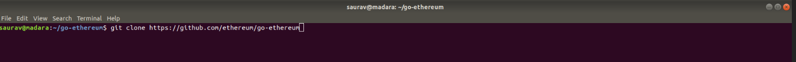
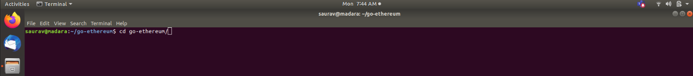
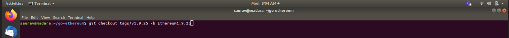
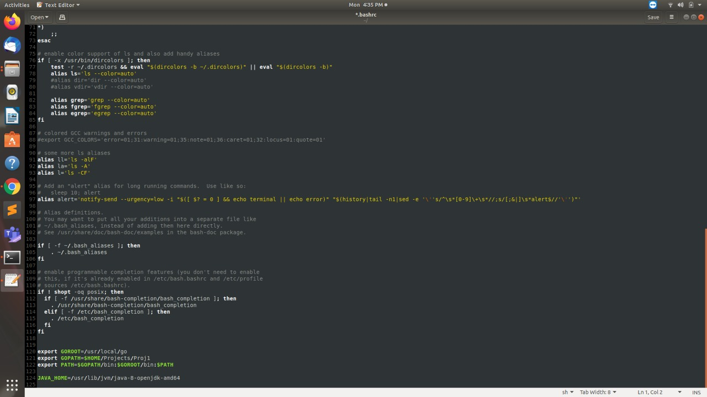
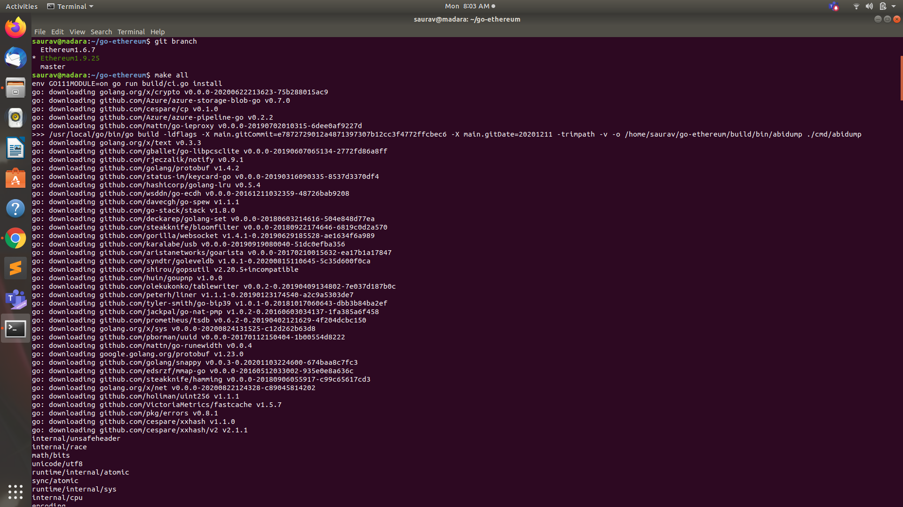
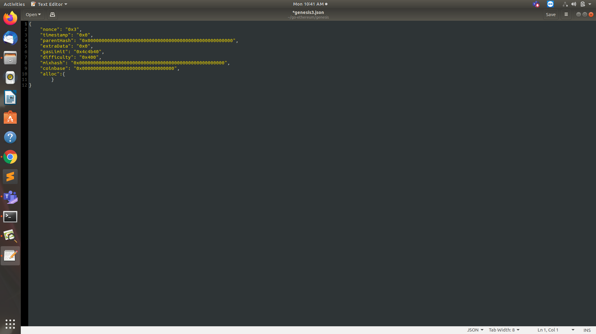
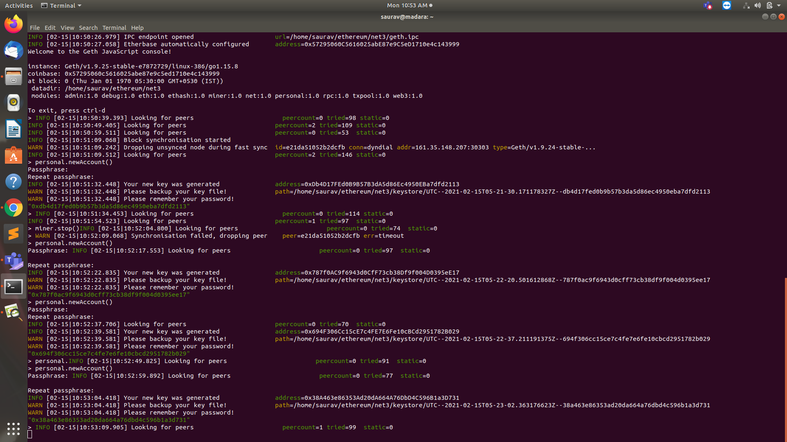
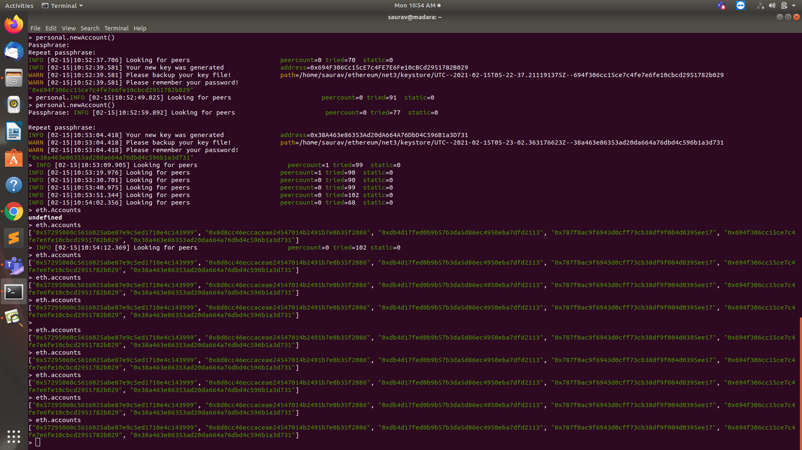
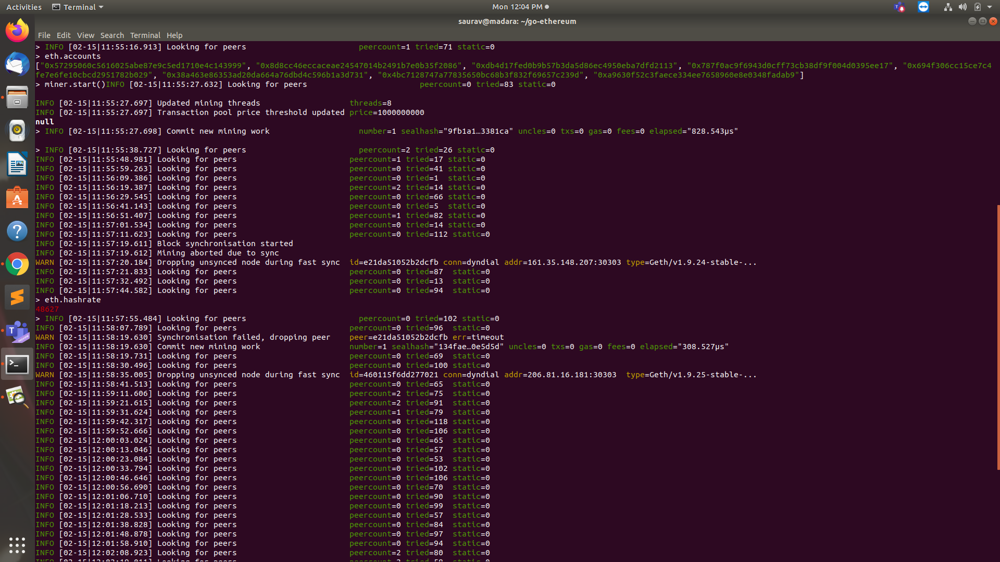

We will implement a digital bank using Ethereum Blockchain. Ethereum is an open-source, public, blockchain-based distributed computing platform. The systems will allow us to:

1. Make a cryptocurrency with a fixed market supply and tokens to represent real world asset values.
2. Create an autonomous private Blockchain with rules on spending money.
3. Mine for a new Ether by validating transactions.

**Step 1 :** Cloning Geth Code:

geth is the command line interface for running a full ethereum node implemented in Go.

```bash
Cloning the geth repository from github.
$ git clone https://github.com/ethereum/go-ethereum
```



**Step 2: ** Move to go-ethereum directory

```bash
$ cd go-ethereum
```



**Step 3:** Branch the latest version of geth.

```bash
$ git checkout tags/v1.9.25 -b EdurekaEthereumV1.9.25
```



**Step 4:** Install go Language on system. Download it from internet. Extract the zip folder

```bash
sudo tar -xvf go1.15.8.linux-amd64.tar.gz
```

.jpeg)

**Step 5:** Move the go folder to usr/local/

```bash
mv go usr/local
```



**Step 6: **Adjust the path in .bashrc

```bash
sudo gedit .bashrc
```

.jpeg)

**Step 7:**Run this command

```bash
$ make all
```



**Step 8:**Creating Genesis Block
A genesis block is the first block of a block chain.
To create the genesis file, execute the following commands:

```bash
$ cd go-ethereum
$ mkdir genesis
$ cd genesis
```

**Step 9:** Step 5. Creating genesis.json in genesis folder

```bash
$ gedit genesis.json
```

This is like making Rules for our Blockchain
The rules for our Blockchain will be included in the genesis.json file we have created. Add the following code in your genesis.json file:

**Step 10:** Now we need to initialize the blockchain.

```bash
$ /home/saurav/go-ethereum/build/bin/geth --datadir ~/ethereum/net3 init genesis/genesis3.json
```

**Step 11:** Run the geth console. 

```bash
$ /home/saurav/go-ethereum/build/bin/geth --datadir ~/ethereum/net3/ --networkid 3 console
```

**Step 12:** Creating Accounts

**personal.newAccount()** : it creates a new account as part of your blockchain which has a specific wallet attached to it.



**Step 13:** Checking the various accounts which are part of my blockchain.

**eth.accounts:** It helps you check the various accounts which are part of your blockchain.



**Step 14:** 

**eth.blockNumber():** this helps you to identify the number of blocks that are part of your blockchain.


**Step 15:** miner.start(): this function is used to start the mining process.



**Step 16:** miner.stop() Stop the mining operation.


**eth.blockNumber():** executing this command after the mining process tells you at which block number you are at after performing the mining operation
**eth.getBalance:** (“account number”): this command is used to check the ether balance in the specified account