## Blockchain Fundamentals

### Why Blockchain ?

Blockchain is one of the most trending topic in todays era. It is used highly for transaction management and it is replacing the current transaction management system. Something which is going to be replaced must have some bad factors for it to be replaced. 

**Issues with current Banking System**

- **High Transaction Fees**

  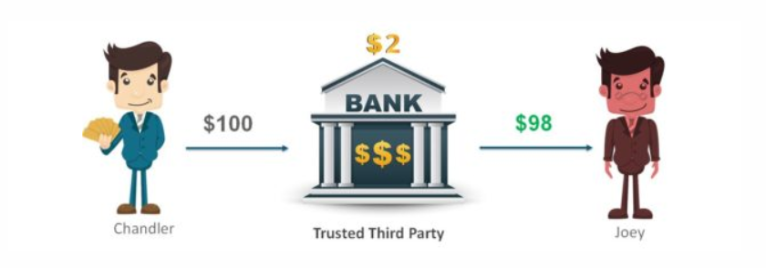

  The issue of Transaction Fees -  Suppose Chandler is sending $100 to Joe but it must pass through a trusted third party like a Bank before Joe can receive it. A transaction fees of 2% is deducted from this amount and Joe only receives $98 at the end of the transaction. Now this may not seem a big amount but imagine if you were sending $100,000 instead of $100, then the transaction fees also increases to $2,000 which is a big amount. As per a report from SNL Financial and CNNMoney, JPMorgan Chase, Bank of America and Wells Fargo earned more than $6 billion from ATM and overdraft fees in 2015.  

- **Double Spending**

  Bank transaction are prone to double spending.

  

  Suppose here Peter has only $500 in his account. He initiates 2 transactions simultaneously to Adam for $400 and Mary for $500. Normally this transaction would not go through as he doesn’t have sufficient balance of $900 in his account. However, by duplicating or falsifying the digital token associated with every digital transaction, he can complete these transactions without the needed balance. This operation is known as Double Spending.

- **Financial Crisis and Crashes**

  Imagine giving all your saving to someone you trust only to know that they have gone and lost it somewhere else. That’s what happened in the 2007-08 when Banks and Investment Organizations had borrowed heavily and lent it as subprime mortgages to people who could not even pay back these loans. A lot of people lost their jobs as well as money. This in turn lead to one of the greatest financial crisis ever seen and was estimated to have caused losses close to $11 Trillion ($11,000,000,000,000) worldwide. This was just one of the most popular examples, how often have we heard of Banks and Financial service companies crash due to internal frauds? The whole third-party system is something that is built on blind trust on the middle man.

- **Net Frauds and Account Hacking**

  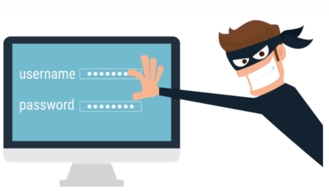

No one is safe from the Cyber fraud! Not even you!

Since the dawn and fame of the Internet, cyber thieves and hackers have invented new ways to rob people to gain easy money or other sensitive information.

According to reports coming in from Reserve Bank of India (RBI) fraudsters have drained Rs 615.39 crore in more than 1.17 lakh cases of credit and debit card frauds over 10 years (April 2009 to September 2019).

> We have seen some of the most common problems faced by everyone. Wouldn’t it be great to have a system that overcame these problems and provided us with a That’s exactly what Blockchain Technology does.

**Let us now try understand how Blockchain and Bitcoins solve these issues**

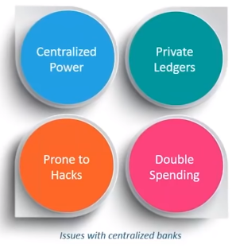

Centralized power was lost when bitcoin came into picture. In bitcoin or blockchain system anyone who get involved in it becomes a powerful authority. The power which is with the single person in the centralized power system get distributed in this system.

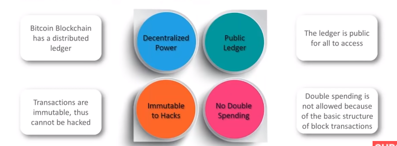

**Decentralized System**
The Blockchain system follows a decentralized approach when compared to banks and financial organizations which are controlled and governed by Central or Federal Authorities. Here, everyone who is part of the system becomes equally responsible for the growth and downfall of the system. Rather than one single entity holding the power, everyone who is involved with the system holds some power.

**Public Ledgers**
The ledger which holds the details of all transactions which happen on the Blockchain, is open and completely accessible to everyone who is associated with the system. Once you join the Blockchain network, then you can download the complete list of transaction since its initiation. Even though the complete ledger is publicly accessible, the details of the people involved in the transactions remains completely anonymous.

**No Double Spending**
Verification of Every Individual Transaction
Every single transaction is verified by cross-checking the ledger and the validation signal of the transaction is sent after a few minutes. Through the usage of several complex encryption and hashing algorithm, the issue of double spending is eliminated.

**Minimal Transaction Fee or Zero**
Today there close to 650 cryptocurrency but most of them even dont charge a minimal transaction fees. 

### What is Blockchain ?

Blockchain is the technology behind bitcoin. It is the spine of bitcoin system. To keep it simple we can say it is public distributed database which holds the encrypted ledger. This ledger that is shared among everyone in the network is public for all to view. This brings in transparency and trust into the system. It is encrypted to keep the details of the people involved in it completely anonymous. 

A block is the collection of all the recent transaction that have happened and are verified. We create a group of all the transaction details and create a hash code then we store it in block. Once the transaction becomes verified this block becomes the permanent part of the block chain and the chains keep growing.

### What is Bitcoin ?

It is the first decentralized digital currency. It was developed by Satoshi Nakamoto. 

> **Decentralized currency**, peer-to-peer money, and digital currency all refer to bank-free methods of transferring wealth or ownership of any other commodity without needing a third party

We cant create bitcoins as per our needs. It uses various cryptography and mathematical problem to restrict or control its creation and management.

It is highly secured because it is created and held electronically in a peer to peer open ledger called the block chain. 

Ledger is produced by people using software that solves mathematical problem. 

#### Bitcoin Transaction

James wants to transfer 500 bitcoin to Kevin. It is Lisa & Robert job to look that if james has enough bitcoins or not.

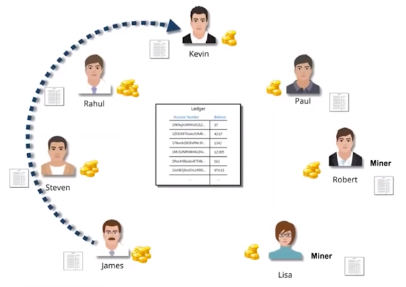

Lisa and Robert are going to check the complete transaction history of james. They are going to see at any point of james has received more than 500 bitcoins or atleast hold a corresponding balance of 500 bit coins. All previous transaction must be checked including his current credit and previous debit history. This all block validation gets completed in 10 minutes. But it is advised to wait for 30 minutes before completion of transaction.

Since all transaction are checked so this also solves the problem of double spending.

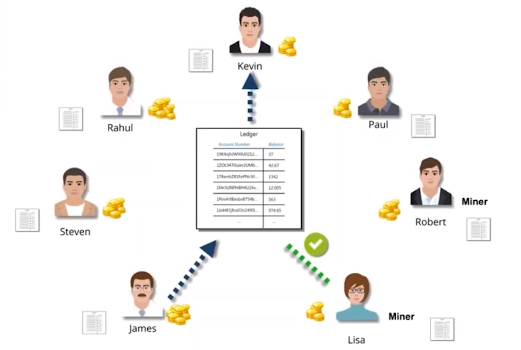

##### Why will Lisa & Robert validate the transaction ?

The miner who validate the transaction as well as completes the next block of the blockchain gets 12.5 BTC(33-34 thousand dollar) as incentive for the creation of new block. 

But mining is not simple it require alot of resource.

### How Blockchain achieve the Bitcoin solution ?

The unique number and specify amount you need to send. It is transmitted to all who is the member of bitcoin network. Once they receive and validation is done then this transaction become part of the new block which is going to be created.

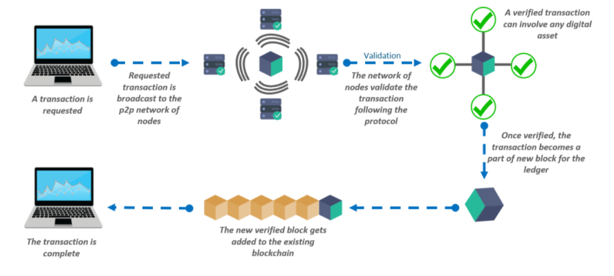

### Three Key Features of Blockchain

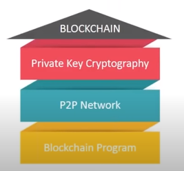

These features are the reason which makes blockchain more powerful.

##### **Private Key Cryptography**

Blockchain uses Private Key Cryptography to secure identities and hash function to make the blockchain immutable. This hashing algorithm is so precise and complex such that a single comma or space brings a great change in hash value. 

Private Key Cryptography involves two different keys, private and public. One key is purposely kept private, the other key which is public is provided to the other party. We share the public key it is similar to account no. So if we want to send money to someone we simply request for their public key.

On the basis of data we can decide it should be encrypted with public key or private key and the other would be used for decryption.

This is called asymmetric encryption.

##### **P2P Network**

P2P machines on the network help in maintaining the consistency of distributed ledger. Let say a Person tries to make a change with a transaction or block which is a part of blockchain. Then that change doesn't get added or reflected because most people over the network have the original blockchain. This change doesn't get accepted and become rejected.

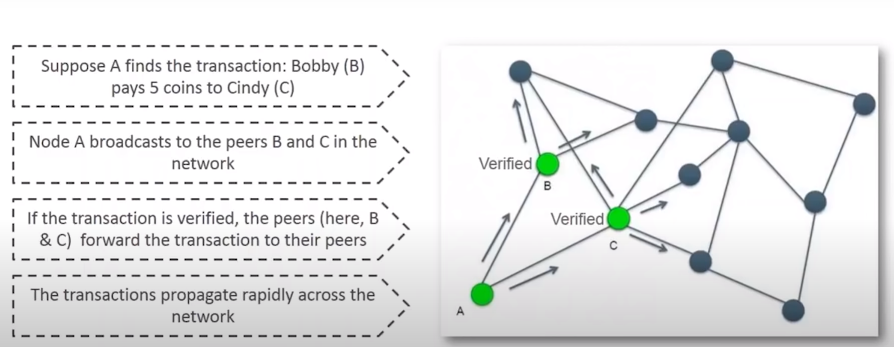

Suppose a member in network tries to modifies the data . He suggest amount has to come to his node instead of C. So once he suggest there occurs a majority and minority difference. But since the majority of node has correct details. The suggestion gets rejected. 

**Central Ledger** 

So here if the central database or ledger get corrupted. The entire data is lost. And there can be money crisis or crashes. But Blockchain has solved this problem with help of distributed ledger. Each member over the network has a copy of the ledger. So it ensures no fraud can happen. So if anyone loses his copy he can ask from another. And even changes or fraud cant occur because the ledger is public.

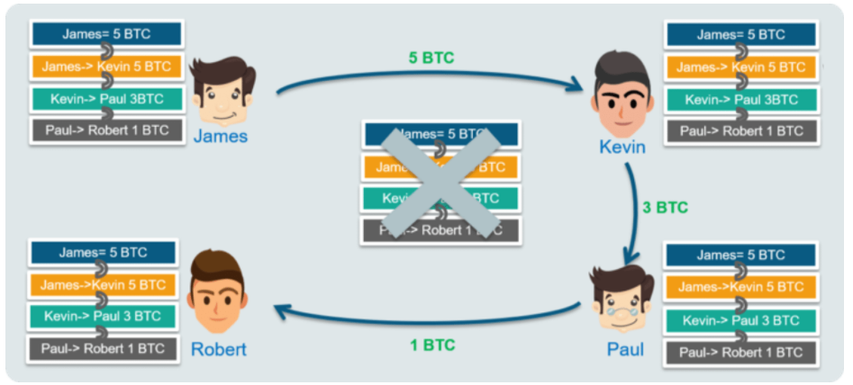

Every single person on the network has a copy of the ledger. There is no single centralized original copy. Ledger here means the copy of all the transactions that ever happened.

**P2P Network - Digital Signature**

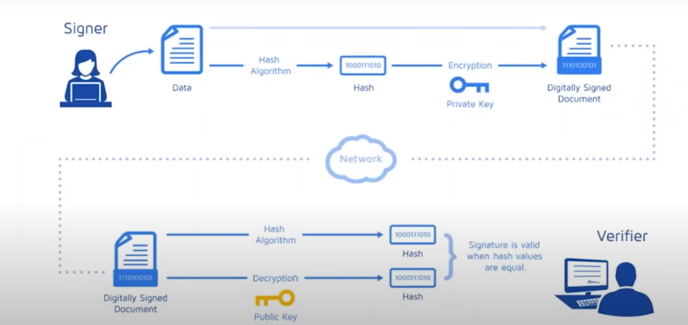

A digital signature is a very important part of the transaction detail. It ensures that the person who is sending the money is the real person and the amount which is being transacted is the correct amount.

The hash algorithm is fed the public key of sender & receiver as well as the amount which has to be transacted which is encrypted with the help of private key which then is added as a digital signature to the document. This is the same document which has the public key of sender & receiver as well as the amount. Once it get transmitted across the network , we feed the data to the hash algorithm which again hash the amount which have to be sent and public key of user & receiver. We also the decrypt the signature using the public key. If the hashes are same then we can call the transaction is same and hasn't been modified.

##### Blockchain Program

- It can implemented on multiple domains.

- It is a concept and can be implemented by any language. 

- Solidity is the most preferred default for writing programs in Blockchain.

### Blockchain Transaction

In any blockchain:

- Every transaction that get verified and validated in the process of creation of new block is logged including information on the time, date , participants and amount of every single transaction.
- Each node of the network hold the complete or full copy of blockchain.

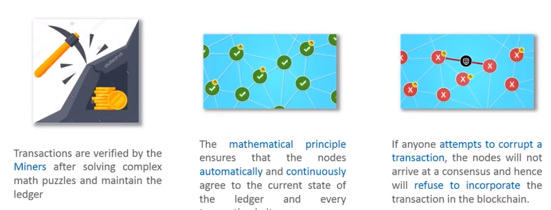

### Blockchain Types

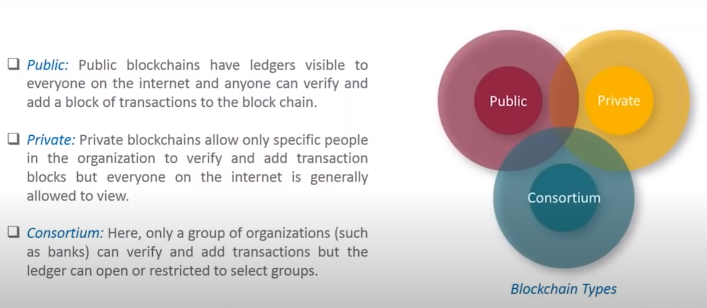

### Blockchain Use Cases

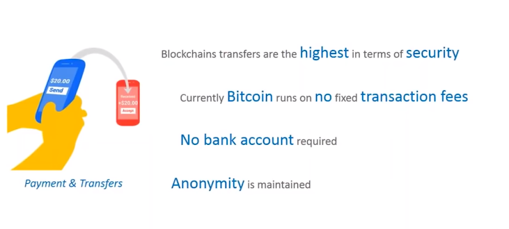

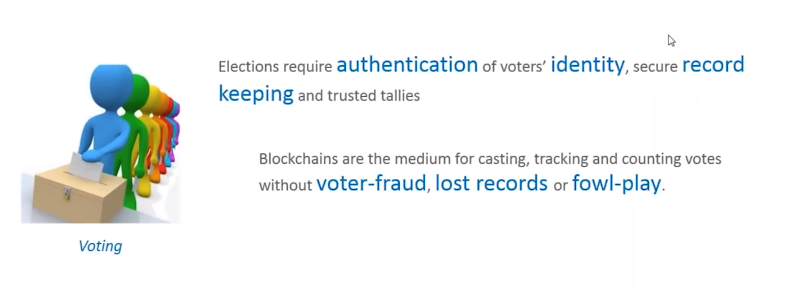

