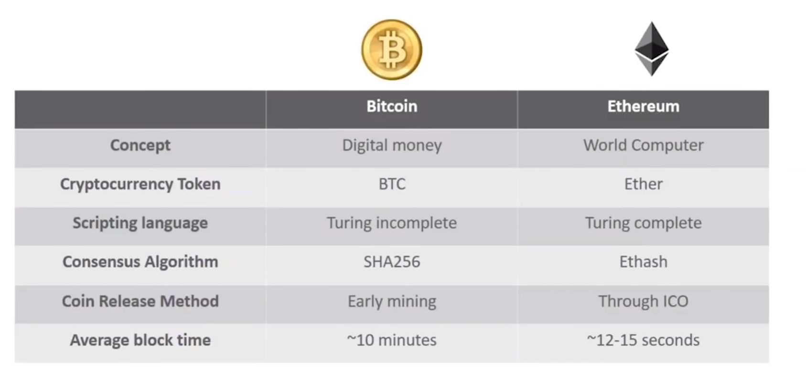
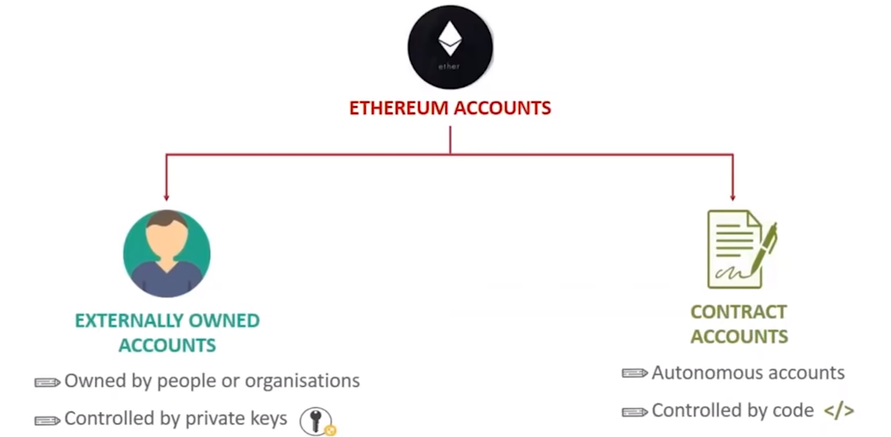
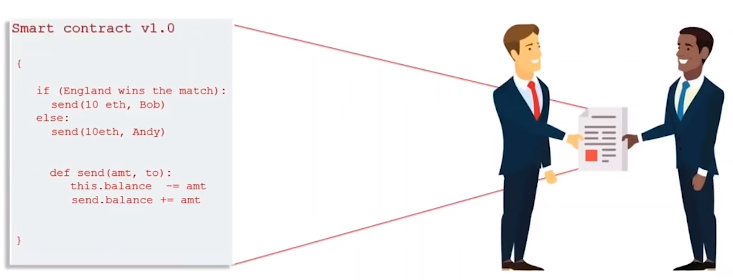
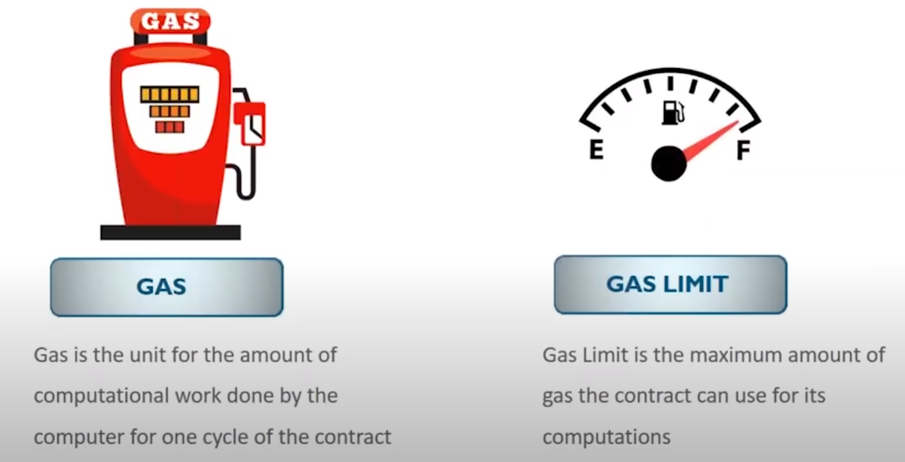

# What is Ethereum ?

Ethereum is an open-source, publicly distributed computing platform, featuring smart contract functionality to build decentralized apps on top of this platform.

The value token of the Ethereum blockchain is called Ether. Ethers are the cryptocurrencies token for Ethereum network and they are used to pay for the transaction fees. 

## Why Bitcoin was Developed when Bitcoin existed ?

They are conceptually different. Bitcoin core idea was to bring up decentralized digital money that isn't governed by anyone. BTC stand for bitcoin cash. 

Turing complete means it can solve any computation problem by itself given enough time and energy.

ICO :- Initial Coin Offering.

## Types of Ethereum Accounts

### Smart Contracts

Contracts account operates on codes which are written in smart contracts. User can create a new contract by deploying code to the blockchain. Smart contracts are basically immutable pieces of codes that run on the ethereum network to perform certain transaction or task. When these contracts are running on the blockchain they act like a self operating computer program that automatically executes when specific condition are met.

A contract between two parties is written as a code in Blockchain. The individual involved are anonymous but the contract is public to everybody on the blockchain. When an triggering event occurs the contract execute itself according to the terms of code.

The codes in these contract are written in a special contract specific language called Solidity.

We use this language instead of already present language because using main stream language on the public blockchain add value . Anything added on the blockchain becomes immutable. So there is no chance of big fixing. It cost money for executing each instruction. So if we use C then it would cost us alot of amount.

**Solidity** is a contract-oriented, high-level language for implementing smart contracts on the Ethereum Virtual Machine.

### Ethereum Virtual Machine (EVM)

It is a turing complete software that runs on the ethereum network. It enables anyone to run the program regardless of the programming language and even non specialized programmer can create the program on the evm. 

Suppose user request 2 ether from the sender . Sender initiates the transaction message code and must pay for each step of the program it activated including the computation and memory storage. This fee is paid in ether which is taken from the wallet of the sender. This transaction fee is collected by the nodes in the network. Each and every nodes of the network run the EVM to execute the same instruction and this is how the block chain database is maintained and updated by the many nodes connected to the network. Now all of these nodes are the miner node which execute and verify the transaction that updates the state of account in ethereum blockchain. Now once the transaction is verified and recorded the user get 2 ether in his wallet.

#### Ethereum Gas

Gas is basically the execution fee sender pays for running the program on EVM. It's called gas because fee act as crypto-fuel driving the execution in smart contracts.

